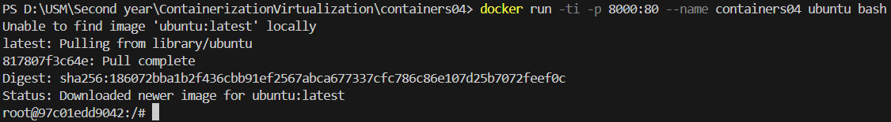
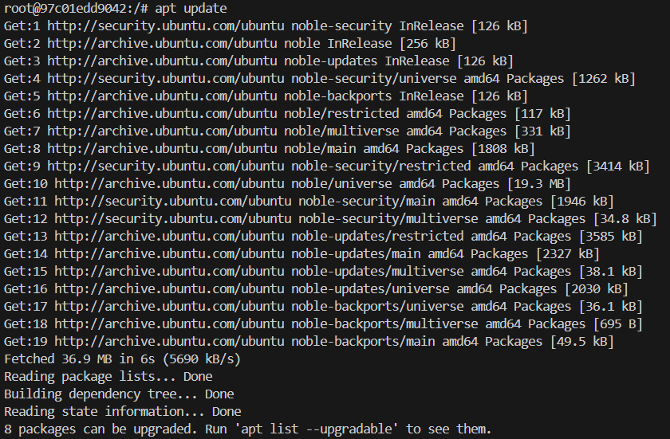
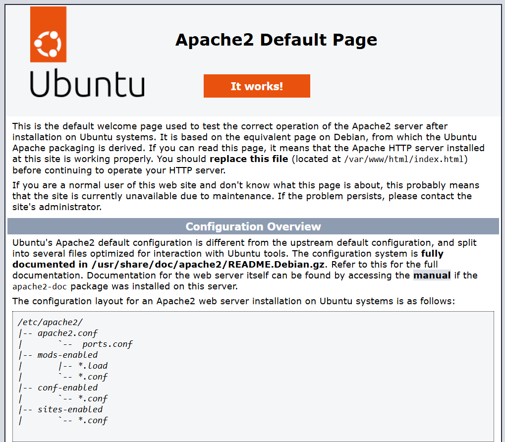
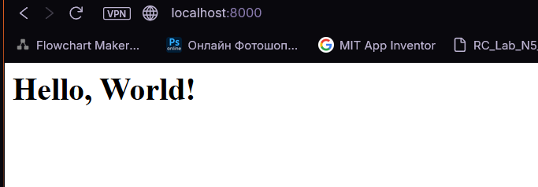
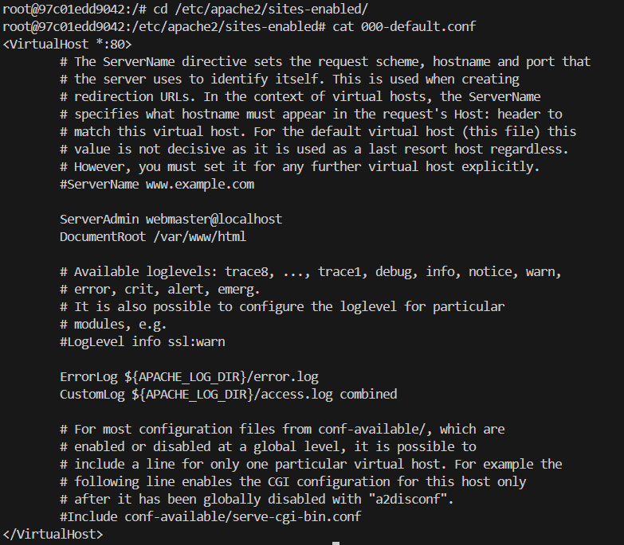
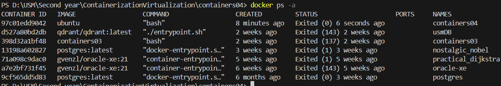
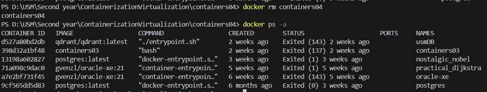

# Лабораторная работа N4: Основы работы с Docker и Web-сервером Apache

## Цель работы

Данная лабораторная работа призвана напомнить основные команды ОС Debian/Ubuntu.  
Также она позволит познакомиться с Docker и его основными командами.

## Задание

Запустить контейнер Ubuntu, установить Web-сервер Apache и вывести в браузере страницу с текстом "Hello, World!".

### 1. Запуск контейнера Ubuntu

В терминале выполняем команду:

```bash
docker run -ti -p 8000:80 --name containers04 ubuntu bash
```

**Функции команды:**

* `docker run` — запуск нового контейнера.
* `-ti` — запуск в интерактивном режиме с терминалом ();
* `-p 8000:80` — проброс порта 80 контейнера на 8000 хоста;
* `--name containers04` — задаёт имя контейнера;
* `ubuntu` — образ для запуска;
* `bash` — запускает терминал внутри контейнера.




### 3. Обновление и установка Apache

```bash
apt update
apt install apache2 -y
service apache2 start
```

**Назначение команд:**

1. `apt update` — обновление списка пакетов.
2. `apt install apache2 -y` — установка Apache без подтверждений.
3. `service apache2 start` — запуск службы Apache.




### 4. Проверка работы сервера

Открываем браузер и вводим:

```
http://localhost:8000
```

**Результат:**
Появляется стандартная страница Apache с сообщением о том, что сервер работает.



### 5. Создание своей страницы

```bash
ls -l /var/www/html/
echo '<h1>Hello, World!</h1>' > /var/www/html/index.html
```

**Назначение команд:**

* `ls -l /var/www/html/` — показывает содержимое каталога с веб-страницами;
* `echo '<h1>Hello, World!</h1>' > /var/www/html/index.html` — создаёт страницу с текстом "Hello, World!".

Обновляем страницу в браузере. Теперь вместо стандартной страницы видим:



### 6. Просмотр конфигурации Apache

```bash
cd /etc/apache2/sites-enabled/
cat 000-default.conf
```

**Результат:**
Вывод содержимого файла конфигурации Apache для виртуального хоста. Cодержит указания DocumentRoot, логов и портов.



### 7. Завершение работы с контейнером

Закрываем терминал командой:

```bash
exit
```

Просмотр контейнеров:

```bash
docker ps -a
```


Удаление контейнера:

```bash
docker rm containers04
```

**Назначение команд:**

* `exit` — выход из контейнера;
* `docker ps -a` — просмотр всех контейнеров, включая остановленные;
* `docker rm containers04` — удаление контейнера.



## Выводы

1. Были изучены основные команды Docker для запуска и управления контейнерами.
2. Установлен и настроен Web-сервер Apache в контейнере.
3. Научились пробрасывать порты контейнера на локальную машину и изменять содержимое веб-страниц.
4. Получен практический опыт работы с файловой системой и конфигурационными файлами Ubuntu в контейнере.
